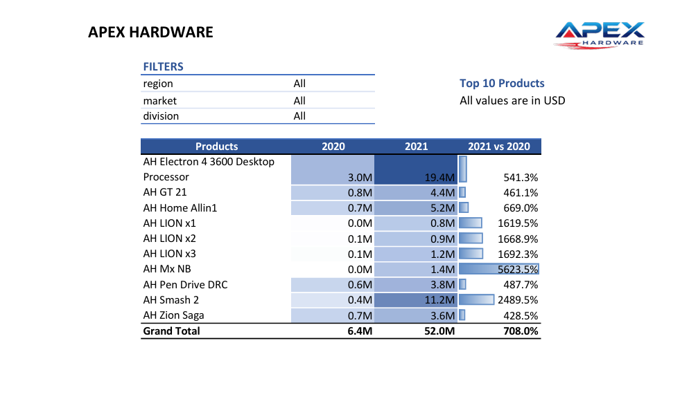
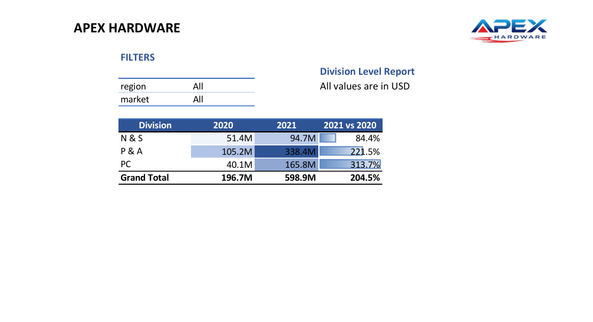
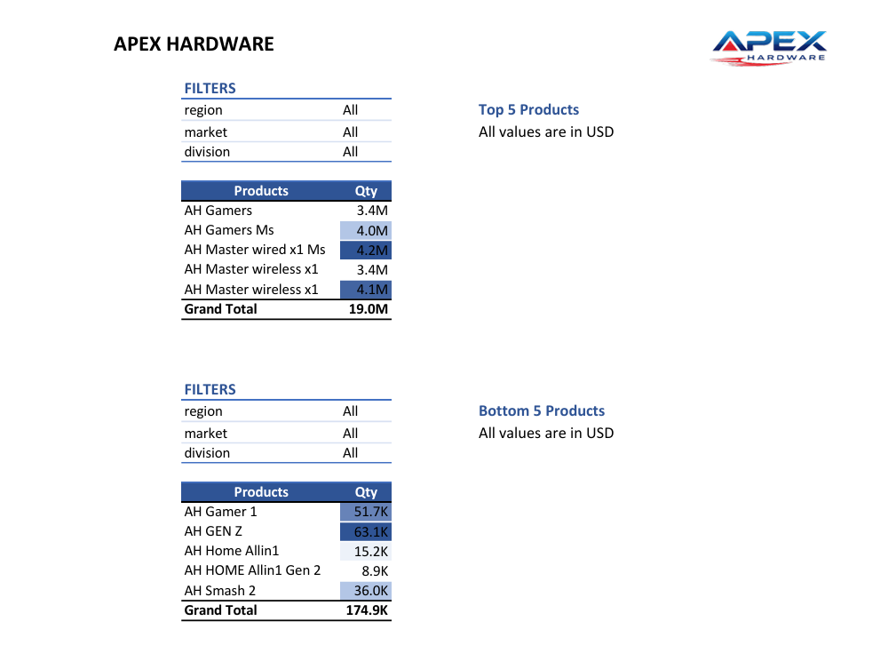
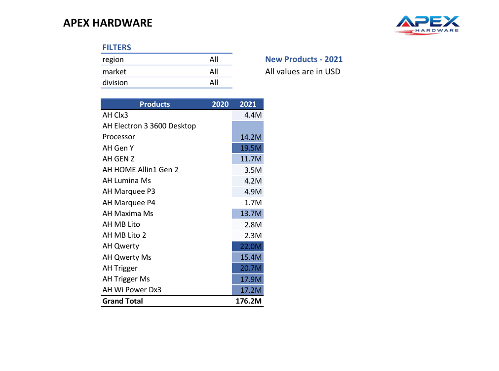
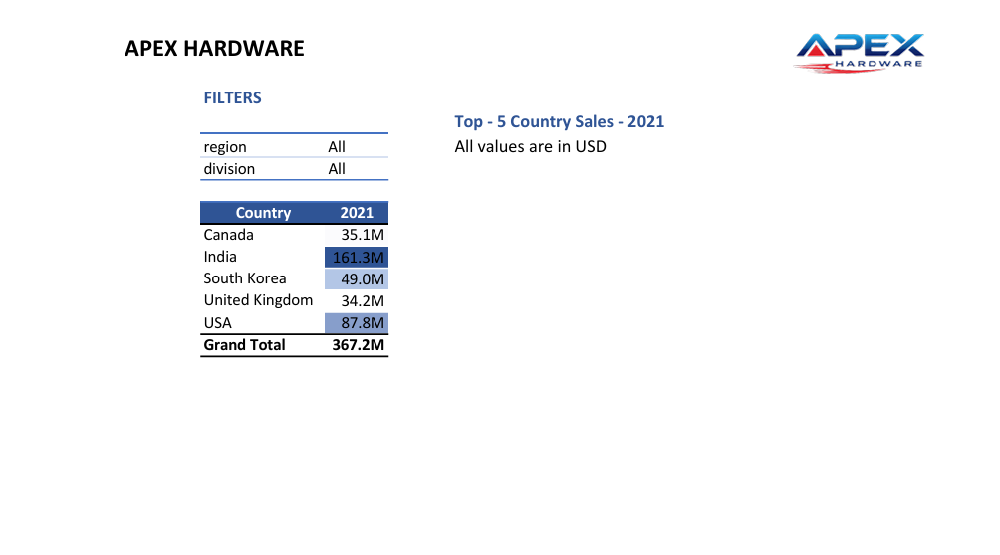

# 📊 Sales-Analytics-Excel

## 📖 Project Overview

This project presents **Sales Analytics Reports** for APEX Hardware, designed to analyze customer performance and evaluate market performance against sales targets. The reports provide actionable insights into revenue trends, growth rates, and regional performance using historical sales data.

The reports focus on:

* Customer-wise sales performance
* Market (country-wise) performance vs targets
* Year-over-year (YoY) growth analysis

---

## 🎯 Project Objective

1. Create a **_[customer performance report](https://github.com/KirandeepMarala/Excel-Sales_Analysis/blob/main/Customer%20Performance%20Report.pdf)_**
2. Conduct a comprehensive comparison between **_[customer performance report](https://github.com/KirandeepMarala/Excel-Sales_Analysis/blob/main/Customer%20Performance%20Report.pdf)_**

---

## ❓ Business Questions & Insights

### 🔹 Top 10 Products by Sales Growth (2020–2021)

Identified products with the highest percentage increase in net sales, highlighting high-growth opportunities.

📸 **Report Preview:**

---

### 🔹 Division-wise Sales Report

Analyzed net sales for 2020 and 2021 across divisions along with growth percentage.

📸 **Report Preview:**

---

### 🔹 Top 5 & Bottom 5 Products by Quantity Sold

Determined best-selling and least-performing products to support inventory and sales strategies.

📸 **Report Preview:**

---

### 🔹 New Products in 2021

Identified newly introduced products by filtering items with 0% values in the "2021 vs 2020" comparison.

📸 **Report Preview:**

---

### 🔹 Top 5 Countries by Net Sales (2021)

Highlighted leading markets contributing the most revenue.

📸 **Report Preview:**

---

## 📈 Key Insights

* Significant overall sales growth observed from 2019 to 2021
* Strong performance from major customers like e-commerce platforms
* India, USA, and South Korea are key revenue-generating markets
* Most markets showed growth but slightly underperformed against targets
* Several products demonstrated exceptionally high growth rates

---

## 📊 Purpose of Sales Analytics

* Enable businesses to monitor and evaluate sales performance
* Support data-driven decision-making

---

## 📌 Importance of Analyzing Sales Data

* Identify sales trends and patterns
* Track key performance indicators (KPIs)
* Measure business growth over time

---

## 📊 Role of Reports

* Determine effective customer discount strategies
* Support negotiation decisions
* Identify expansion opportunities in high-potential markets

---

## 🛠️ Technical Skills

* Proficiency in **ETL methodology (Extract, Transform, Load)**
* Creating date tables using **Power Query**
* Deriving **fiscal months and quarters**
* Building data models using **Power Pivot**
* Integrating additional data into existing models
* Using **DAX** to create calculated columns

---

## 🤝 Soft Skills

* Strong understanding of sales reporting
* Designing user-centric and intuitive reports
* Optimizing report performance
* Strategic and structured problem-solving approach

---

## 🚀 Conclusion

This project demonstrates the ability to transform raw sales data into meaningful insights through structured analysis and reporting. It highlights how data-driven approaches can support better business decisions, improve performance tracking, and uncover growth opportunities.

---

## 📸 Dashboard Preview (Optional)

*Add full dashboard screenshots here for better visualization of your project.*
